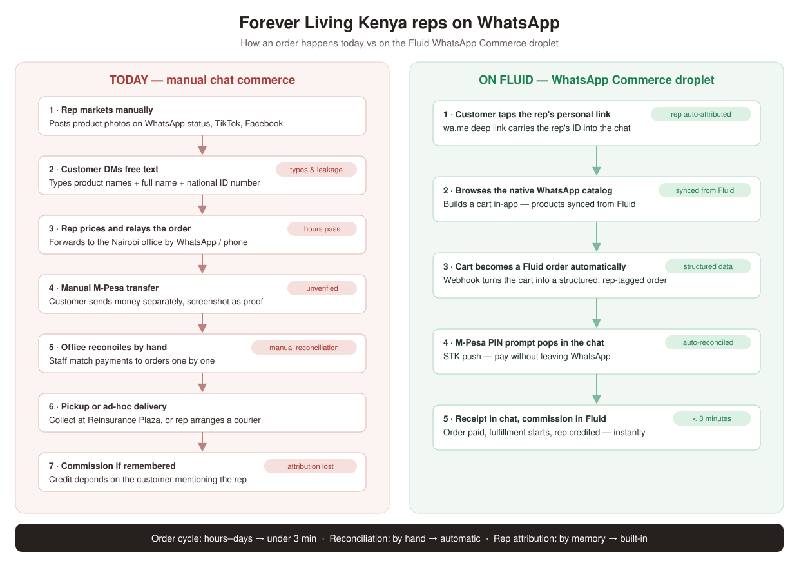
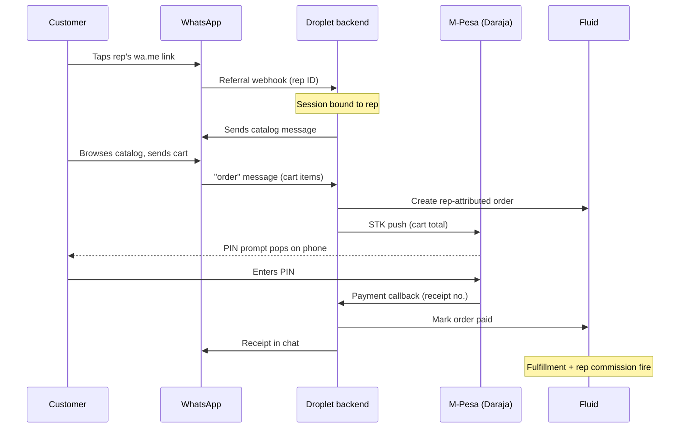

# WhatsApp Commerce Droplet — Technical Spec

This spec describes how the Fluid droplet delivers **"WhatsApp commerce done
properly"** for Forever Living Kenya — and any direct-selling company in an
M-Pesa market. Instead of free-text orders with ID numbers, customers browse a
native WhatsApp catalog, their cart becomes a Fluid order automatically, and
they pay by M-Pesa without ever leaving the chat.

It implements opportunity #3 from the
[digital commerce teardown](./forever-living-kenya-teardown.md).



---

## 1. The problem

Today an FL Kenya order over WhatsApp works like this: the customer types
product names, their full name, and their national ID number into a chat.
Staff price the order by hand, wait for an unverified M-Pesa transfer,
reconcile it manually, and arrange pickup. The rep only gets commission if
the customer remembers to mention them.

Every step loses orders, and none of it produces structured data.

## 2. The solution in one flow

A customer taps their rep's WhatsApp link and five things happen, all inside
the chat:



**Why STK push and not "WhatsApp Pay"?** Meta's native in-chat payments only
exist in India and Brazil. In Kenya, the STK push achieves the same
experience — the M-Pesa PIN prompt overlays WhatsApp, so the customer never
leaves the chat. Kenyan insurers and schools already collect payments this
way; it is the established local pattern, not an experiment.

## 3. What's already scaffolded

All of this compiles today (TypeScript clean, Prisma schema valid):

- **`backend/src/routes/whatsapp.ts`** — the WhatsApp webhook. Handles
  Meta's verification handshake, parses inbound messages, binds sessions to
  reps via the deep-link referral, and turns cart submissions into pending
  orders plus an STK push.
- **`backend/src/services/whatsappService.ts`** — the Cloud API client.
  Signature verification, inbound message parsing, and sends for text,
  catalog, and order-confirmation messages.
- **`backend/src/services/mpesaService.ts`** — the Daraja client. OAuth,
  STK push, and callback parsing.
- **`backend/src/routes/mpesa.ts`** — the payment callback. Settles the
  payment record, flips the order to paid, and sends the in-chat receipt
  (or a "reply *pay* to retry" notice on failure).
- **Prisma models** — `WhatsAppSession` (conversation state + rep binding per
  customer phone), `MpesaPayment` (one row per STK push, keyed by Daraja's
  CheckoutRequestID, raw callback kept for audit), `WhatsAppConfig`
  (per-tenant credentials), `MessageTemplate`, and `CartRecovery`.
- **`backend/src/services/templateService.ts`** — the template manager. Ships
  a pre-built, compliance-reviewed library (cart recovery ×3, receipt, order
  status, payment failed), submits it to Meta on the client's behalf, and
  polls approval status. Clients never open the Meta console.
- **`backend/src/services/cartRecoveryService.ts`** — abandoned-cart recovery
  on a 30-minute / 24-hour / 72-hour arc, plus `reply pay` retry that re-fires
  the STK push. Industry benchmark for this flow is 18–23% recovery, and
  automated flows drive 60–70% of WhatsApp revenue.
- **`backend/src/routes/templates.ts`** and **`routes/jobs.ts`** — template
  seed/submit/sync endpoints and the recovery runner
  (`POST /api/jobs/cart-recovery`, secret-protected, cron-friendly, with an
  optional in-process interval for demos).

### The 24-hour window, handled correctly

Free-form messages are only legal within 24 hours of the customer's last
inbound message. The recovery service checks `whatsapp_sessions.lastMessageAt`
and picks its channel accordingly: **inside** the window it sends plain text;
**outside** it requires an APPROVED template and **skips the send rather than
attempting a non-compliant one**. That dependency is why the template manager
had to land before recovery could work — it is the critical path, not the
conversation state machine.

### Rep attribution, the key MLM detail

Each rep shares a personal link:

```
https://wa.me/<company-number>?text=ref:<shareGuid>
```

The `shareGuid` is already synced by the existing rep webhook. When the
customer's first message arrives with that token (or via a click-to-WhatsApp
ad referral), the session is bound to the rep — and every subsequent order
from that customer carries the attribution automatically. No more "did you
remember to mention me?"

## 4. What remains before MVP

Four TODOs are marked inline in the code:

1. **Raw-body signature verification** — register a raw-body parser in
   `config/fastify.ts` so `X-Hub-Signature-256` can be checked properly.
2. **Catalog sync** — push Fluid products to the Meta Commerce Manager
   catalog (`/{catalog_id}/items_batch`, retailer_id = SKU), triggered from
   the existing product webhook.
3. **Fluid order integration** — create the order in Fluid with the
   installation's DIT token and mark it paid on settlement, so fulfillment
   and rep commissions fire upstream (scaffold records orders locally).
4. **Multi-tenant routing** — map the receiving WhatsApp phone number ID to
   an installation (scaffold uses the first active one).

## 5. Configuration

### Environment variables

**WhatsApp:** `WHATSAPP_ACCESS_TOKEN`, `WHATSAPP_PHONE_NUMBER_ID`,
`WHATSAPP_VERIFY_TOKEN`, `WHATSAPP_APP_SECRET`, `WHATSAPP_CATALOG_ID`

**M-Pesa:** `MPESA_ENV` (sandbox/production), `MPESA_CONSUMER_KEY`,
`MPESA_CONSUMER_SECRET`, `MPESA_SHORTCODE`, `MPESA_PASSKEY`,
`MPESA_CALLBACK_URL`

### External setup checklist

- [ ] Meta Business verification (1–3 days — **the long pole; start first**)
- [ ] WhatsApp Business Account + dedicated number on the Cloud API
- [ ] Commerce Manager catalog created and policy-reviewed (supplements need
      careful copy — no health claims)
- [ ] Webhook subscribed to `messages` with the verify token
- [ ] Message templates approved for re-engagement outside the 24-hour window
- [ ] M-Pesa paybill/till + Daraja production app (or a PSP like IntaSend /
      Pesapal to add Airtel Money and cards)
- [ ] For FL specifically: corporate sign-off to run this as an official channel

## 6. Rollout phases

**Phase 1 — MVP (~3–4 weeks).** The scaffold plus the four TODOs above.
Outcome: a customer can browse, cart, pay, and get a receipt entirely in
WhatsApp, with the rep attributed.

**Phase 2 — Productionization.** Multi-tenant config UI, conversation state
machine (quantity edits, delivery vs pickup), payment retries and callback
idempotency, STK timeout queries, courier handoff.

**Phase 3 — Growth.** WhatsApp Flows checkout screens (address +
confirmation in-chat), a rep dashboard in the droplet frontend (shared
links, attributed orders, conversion), re-engagement templates (abandoned
cart, 28-day gel replenishment), Airtel Money and card fallback via PSP.

## 7. Risks

- **Meta verification delays** → start it first; everything else parallelizes.
- **Supplement content policy** → pre-review catalog copy, keep health claims out.
- **24-hour messaging window** → approved utility templates for receipts and
  delivery updates.
- **Daraja callbacks are unsigned** → IP allowlist, secret path segment, and
  status-query reconciliation.
- **STK abandonment** (customer never enters PIN) → timeout query plus a
  one-tap retry message.
- **Attribution gaming** (link swapping) → first-touch binding stored per
  session; corporate policy decides override rules.

## 8. Success metrics

| Metric | Today | Target |
|---|---|---|
| Order cycle (message → paid) | Hours to days | Under 3 minutes |
| Orders auto-reconciled | ~0% (manual) | Over 95% |
| Orders with rep attribution | Customer's memory | Over 80% |
| STK abandonment rate | — | Watch metric; drives retry UX |
